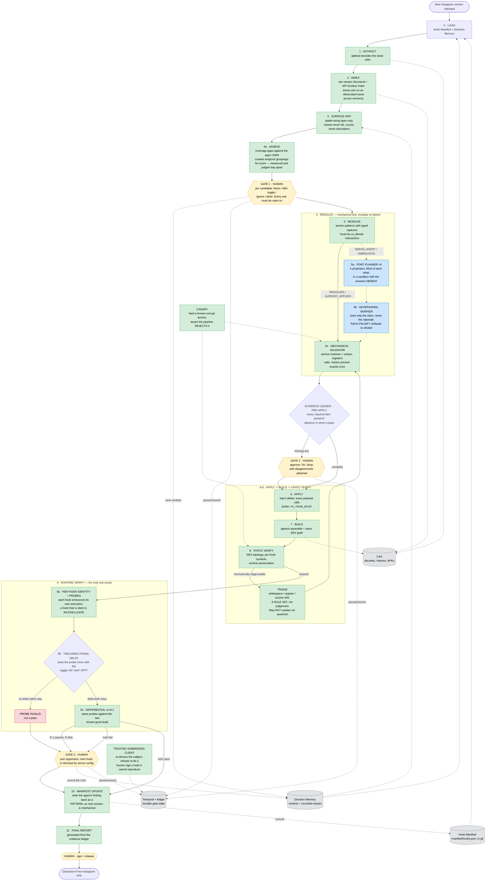

# dfinsta e2e flowchart

Rewritten 2026-08-02, after building the thing. The previous revision drew six
LLM boxes as stages in the flow. That was wrong in a way that mattered, and the
code had already found the right shape without the diagram catching up.

**Agents are escalations, not stages.** `resolve.py`'s outcome precedence is
`CONFLICT > ALREADY_APPLIED > RESOLVED > AMBIGUOUS > UNRESOLVED > NOT_FOUND >
NEEDS_AGENT`. `NEEDS_AGENT` is what the deterministic method *returns* when it
cannot produce a unique answer — so an agent runs on failure, never by default.
A stage always runs; an escalation runs only when it must, and only the second
one lets the agent count fall as the manifest learns.

Of the six boxes previously drawn blue, **two turned out deterministic once we
tested whether they needed judgement, one was always a rule set, one is
templating, and two are real.** That is the whole design note.

## Flowchart

**Legend:** 🟩 deterministic · 🟦 LLM agent, reached only on escalation ·
🟨 human decision · ⬜ storage · 🟥 failure state

Dashed edges into 5a/5b are the escalation path. On a version where every hook
resolves mechanically, **no agent runs at all**.

---

## What is actually built

| Stage | State |
|---|---|
| 0 Load, 1 Extract, 2 Index | done, driven by `driver.py` |
| 3 Surface diff | done — `surface_diff.py` |
| 4a Assess | done — `assessment.py` |
| 4b Gate 1 contracts | done — `feature_gate.py`. **Nothing raises it, and nothing can**: no producer joins stage 4a to CAS |
| 5 Resolve | done — **7 of 7 hooks resolve mechanically on 430 *and* 439**, given their hosts |
| 5 · capture supply | done — `capture_supply.py`. A payload capture the anchor cannot bind is filled by a supplier chain, deterministic first, agent as fallback. A decline is a returned value; a failure is an exception |
| 5a/5b Proposer + verifier | done, and the full k-of-n + verifier chain has run for real: 2-of-3 on the host, 1-of-3 by effect, both verifiers failed to refute — one signal passed, one did not, gate correctly shut |
| 5c Mechanical validator | done, with mutation tests |
| Evidence ledger | done, phased pre-apply / post-build; records a host agreement as well as a whole-patch one |
| 6-8 Apply / Build / Static verify | done, target-neutral, proven on 430 and 439 |
| 9 Runtime verify | probes + per-hook identity done, own-profile guard device-verified; **differential vs N−1 still has no producer** |
| 10 Manifest update | Decision Memory half done (`manifest_update.py`); **agent cost is recorded on every port** (`agent_cost.py`, called by the driver) — 439 cost 2 agent invocations against 5 mechanical hooks, verdict `UNTESTABLE` until a second version is ported; the proposal-to-pattern generaliser is not built |
| 11 Final report | not started |
| Host discovery in the driver | **done** (`discovery.py`, `--discover-hosts`). 439 ported unattended: 2-of-2 on one settings host, 3-of-3 on the other, neither refuted, gate passed honestly |
| Answering a gate | done — `submission.py` |

---

## Why agents are escalations

Each item below is a correction forced by something that actually happened.

**Every time we tested whether a box needed judgement, it mostly did not.**
Feature discovery became a stable-string diff. The addictiveness assessment
became a query against the app's own curated endpoint arrays, after a
calibration experiment killed the scoring design outright — six of seven
engagement signals were noise, and the *random control* scored 1.18, sitting
between the labelled positives (1.43) and negatives (0.90). A composite score
would have been an authoritative-looking number measuring roughly "how
instrumented is this class". **Spend an hour measuring before building an
agent.**

**Prefer the adversary's own bookkeeping to our inference.** `co_literals` and
the curated endpoint arrays are the same trick: the obfuscator scrambles names,
but the app still has to record what it means somewhere. `LX/03Ez` on 439 is a
69-line constant holder listing exactly the continuous-content surfaces and not
one task endpoint. Found by content, it resolves to the same group on 430 under
a different name.

**Predict which items need an agent, and check the prediction.** The manifest's
`tier` called the split exactly: the five `robust` hooks resolve mechanically,
the two `ui` hooks do not. Treat the tier as a *claim* — if a `robust` hook ever
escalates, that is a manifest bug to fix, not a fallback to accept.

**Confidence is not a control-flow input.** The failure mode is an agent with no
doubt: a proposer asserting a register was "usually null" when it held a live
listener; three anchors reported unique that matched zero times. Escalation
triggers on **absent evidence**, so a confidently-wrong agent fails to produce
evidence rather than needing to confess. Confidence is recorded and never read —
a test varies it across its whole range and pins that no verdict moves.

**Where an agent does run, keep it blind and adversarially checked.** k
proposers run in a sandbox hardlinked outside the repository, because forbidding
a file is not removing it and this repo holds the resolved anchor for every
version ported. The verifier sees the claim and never the rationale, and
defaults to refuted — a verifier shown a fluent justification agrees with it.
That verifier refuted a hook that had already shipped.

**Presence is not execution, and that was four bugs pretending to be four.** The
340 `minshop` substitution, the 430 settings hook, the 439 action-bar hook and a
verifier searching for a string form DEX does not store were all one failure.
Rather than add a fifth check, every payload now calls
`Lcom/dfinstagram/probe;->h_<hook_id>()V` — the identity is the METHOD NAME, so
the call needs no registers and can never force a `.locals` change. On the first
build carrying it, two more hooks turned out never to run.

**"Never executed on my device" is not "dead."** Instagram is heavily
server-config-driven. `replace_reels_homecoming_endpoint` is selected by a
branch on `clips_viewer_homecoming_fyp` plus two MobileConfig flags: correct and
dormant. Find the *selector*; never conclude from silence.

**Triage was never an agent.** The old diagram drew it blue while its own label
said "anchor / register / whitespace only. May NOT weaken an assertion."
Anything constrained enough to be safe there is constrained enough to be code.

**Canaries.** Two checks here silently became vacuous — a Temporal History
privacy assertion that could not fail because payloads are base64-encoded, and a
DEX verifier searching for a non-existent string form. An absence assertion
needs a positive control or it always passes.

**Indexes are per-version only.** Every obfuscated host moved between 430 and
439 (`LX/077K`→`LX/0DnT`, `LX/06X7`→`LX/0Di2`, `LX/05t2`→`LX/04tC`), *and* the
old names still exist as unrelated classes.

---

## The point of stage 10

**An agent's finding must become a deterministic rule.** This is the whole game,
and it is why Manifest Update — currently unbuilt — is worth more than anything
left in stage 5.

The five `robust` hooks were originally found by hand and by agents. They are
mechanical now because what was found got written back as an anchor pattern with
a `co_literals` fingerprint. The settings hooks should follow the same path: a
proposer locates the site once, the pattern goes into the manifest, and the next
version resolves without an agent.

So the number to watch is **agent invocations per port**, and it should fall
with every version ported. A pipeline whose agent count is flat is not learning.

Where that has a limit, say so: the `ui`-tier hooks may never fully mechanize,
because what identifies them is a drawable plus a label plus an own-profile
guard, selected at runtime by a MobileConfig flag, and that shape genuinely
changes between versions. Even there the agent finding converted into a
deterministic rule — *both* action-bar variants must ship, because a flag picks
between them.

---

## The evidence ledger

A hook advances only when every item is present, and each is produced by
something **other than the proposer**. Evidence is phased: four kinds are
derivable from the decode and gate the apply; three need the built APK and gate
the release. Collapsing them would make the pre-apply gate unsatisfiable.

| Evidence | Phase | Produced by | Failure it catches |
|---|---|---|---|
| Anchor resolves to exactly one site | pre-apply | deterministic checker | leading-whitespace anchors; duplicate `A0H`-style traps |
| Registers safe at the insertion point | pre-apply | deterministic checker | clobbering a live register |
| k independent proposers agree | pre-apply | statistics over *effect*, not text | genuine ambiguity, with no self-report |
| Adversarial verifier found no defect | pre-apply | a second agent, told to refute | wrong justifications, mis-sited anchors |
| Build + static assertions pass | post-build | deterministic | malformed injection |
| Runtime probe moves in both directions | post-build | the device | inert patches |
| Differential vs N−1 behaves | post-build | the device | port regression vs broken probe |

Absence is never a pass. A hook that reports nothing is `inconclusive`, never
`failed` — its site may simply not have been exercised, and that is a different
thing from being inert. Anything missing routes to a gate **with the
disagreement attached**, rather than being resolved by the agent that produced
it.

---

## Stage notes

**0-2 Load / Extract / Index** — the Index is rebuilt per version and used only
within it. 181,421 classes in 3.4 s, byte-identical across job counts.

**3 Surface diff** — diffs the stable-string layer only: resource *names* never
ids, class *counts* never descriptor sets, so no descriptor can cross a version
boundary. Measured 430→439: API paths survive 93.9%, stable types 89.3%,
drawable **names** 98.8% — and drawable **ids 0.9%**.

**4 Assess** — no composite score, by experiment. The output separates
**measured** (independently checkable against the decode) from **judged** (an
opinion with its reasoning attached), and the separation is enforced by the
types rather than by convention. First real output: four consumption endpoints
Instagram groups with the feed that DFInsta does not block, including
`feed/injected_reels_media/`.

**5 Resolve** — anchors are patterns with `<name:kind>` captures; payloads
template off them. Where a payload needs a value no anchor can bind — the
settings hook's own-profile guard needs a model register and a self-profile type
— a **supplier** fills it: deterministic first, agent as fallback, and a
supplier that cannot prove its precondition **declines** rather than guessing.
The deterministic one for that guard was derived from 430 and 439 and has zero
reach below 430, which a 340/300 holdout established; its precondition doubles
as the *selector* saying which of the two settings hooks a version can host. Hosts come from a `co_literals` intersection: `clips/discover/`
alone appears in 19 classes on 439, but exactly one class carries all three Reels
endpoints. If a version splits them the intersection empties and the stage
escalates — which is the escalation working as designed.

**5a/5b escalation** — the sandbox is hardlinked (`cp -al`), so it is strictly
read-only: writing corrupts the master decode. The agent gets three verbs —
list, read, search — and there is no fourth; confinement is enforced in-process
by resolving every path and requiring it under the root. Runtime chosen by
measurement, see `docs/PROPOSER_RUNTIME.md`.

**6-8 Apply / Build / Static verify** — DEX topology comes from the target's
resolution, not from code: 439 needed `classes21.dex` because it already ships
`classes20`. Builds are semantically, not bitwise, reproducible — `apktool` full
rebuild stamps every ZIP entry with the build date, so verify by assertion and
never by hash equality against a stored value.

**9 Runtime verify** — needs a connected device, a dedicated test account,
declared cache state and a restart between contrast sides. Counting must be
canonical, not `grep -c`: every live block also emits a `NETWORK_FAILURE_REASON`
field with the same text, and `aware_trace` re-narrates past events at a later
cold start. A build carrying only a subset of hooks is **not a usable app** — it
removes the settings dialog, which is the only route to the toggles.

**10-11 Manifest update / Final report** — see "The point of stage 10". Also
records *misses*: any case where the pipeline was confidently wrong becomes a new
permanent check.

**The gates** — durable, multi-day, and answerable. Timeout means `blocked`,
never implicit approval. A human answers through the trusted submission client,
which re-derives the gate subject from recorded state and refuses to let anyone
sign a hash it cannot reproduce; see `docs/SUBMISSION_CLIENT.md`.

---

## Key terms

- **Hook** — a few lines spliced into Instagram to change behaviour.
- **Hook Manifest** — version-independent intent; the source of truth.
  `manifest/hooks.json`.
- **Structural Index** — per-version class phone-book. **Never** a cross-version
  key.
- **API-Surface Index** — the things Instagram cannot easily scramble: URLs, flag
  names, resource names. The strongest fingerprint measured. Drawable **names**
  are stable; drawable **ids** are not (99.1% renumbered), and string ids are
  unresolvable under sparse encoding (~555 of ~19,000 exposed).
- **Obfuscation** — names are scrambled *and recycled*: `LX/05t2` exists in both
  430 and 439 and is a different class in each.
- **Tier** — *robust* (URL block) · *fragile* (response rewrite) · *ui*
  (on-screen). A claim about whether a hook can be resolved mechanically, and so
  far exactly right: robust ported first try, fragile was dropped as
  unmaintainable, ui was the one silently inert.
- **Escalation** — `NEEDS_AGENT`, returned by a deterministic stage that cannot
  produce a unique answer. The only way an agent runs.
- **Probe** — the runtime check for one hook, plus the evidence that it can
  detect a difference at all. Mandatory per hook, and separate from the hook's
  *identity* call, which proves only that the site executed.
- **Evidence ledger** — the externally produced facts a hook must accumulate
  before it may ship.

---

## Data structures

| Structure | Format | Holds | Lifetime |
|---|---|---|---|
| **Hook Manifest** | JSON | id, intent, intent_constraints, tier, strategy, `co_literals`, anchor patterns, payload template, marker, probe, status | permanent (git) |
| **Decision Memory** | JSON | feature signature → verdict, version, policy revision, evidence fingerprint, **recorded misses** | permanent (git) |
| **Structural Index** | JSONL | descriptor → file, super, interfaces, methods | per-version cache |
| **API Surface** | JSON sets | endpoints[], flags[], resource names[] | per-version cache |
| **Assessment** | structured | candidate id, measured evidence, judged opinion, delivery branch | one run |
| **Proposal** | structured | hook id, host, anchor, payload, evidence chain, alternatives, unresolved | one run |
| **Evidence ledger** | append-only | per hook, per evidence kind, per phase, with producer | one run |
| **Run state** | Temporal + SQLite ledger | gates, decisions, artifact references | durable |

Two manifest details that are load-bearing:

- **Hosts are plural.** The 430 settings hook was runtime-inert because a
  MobileConfig flag selects between two action-bar implementations of the *same*
  control and only one was patched. Both variants must ship.
- **The idempotence marker must be a comment**, never a label. baksmali deletes
  unreferenced labels, so a label marker vanishes on the next rebuild and the
  patch is applied twice. Each hook's marker must also be **distinct** — two
  hooks sharing one marker each read the other's patch as their own, and both
  get dropped from the build while the run reports success.

---

## Storage plan

Four stores:

1. **Hook Manifest** (git) — durable intent, reviewable in a PR, read at Load and
   committed back at Manifest Update.
2. **Decision Memory** (git) — feature verdicts keyed by a stable signature, plus
   recorded misses so each confident error becomes a permanent check. A decision
   is reusable only while feature identity, delivery mechanism, evidence
   fingerprint and policy revision remain compatible.
3. **Content-addressed store** (filesystem, never git, never in prompts) —
   decodes, indexes, APKs. Agents receive **paths and excerpts only**, and never
   through a tool that can leave the sandbox.
4. **Temporal + the SQLite ledger** — durable gate state and the authority for
   artifacts, decisions, evidence and release lineage. Gates may stay open for
   days, which is the reason for a durable workflow engine rather than a script.
   Large payloads never enter Temporal History: the document goes to CAS and the
   Workflow carries only its hash.

Recorded APK hashes are **records, not reproducibility checks** — see the note on
semantic reproducibility above.
