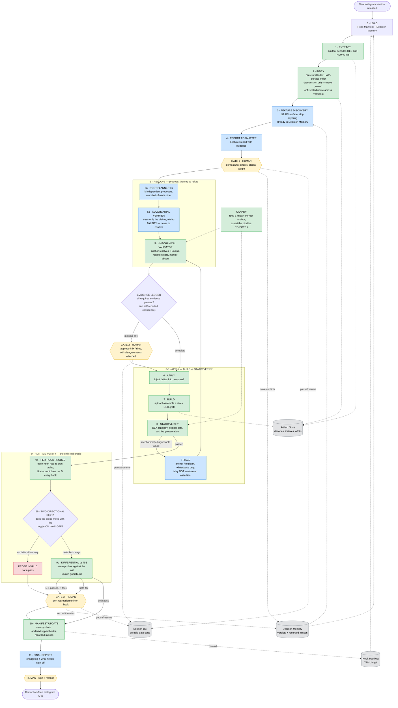

# dfinsta e2e flowchart

Revised 2026-08-01 after porting Instagram 430 → 439 end to end. Every change below
is backed by a failure that actually happened; see "What changed and why".

The foundational structure of the original design held up: deterministic spine,
LLM only at the ambiguous seams, human gates that pause rather than crash. The
corrections are about **how a stage decides it is done**, not about the shape.

## Flowchart



**Legend:** 🟩 deterministic · 🟦 LLM agent · 🟨 human decision · ⬜ storage · 🟥 failure state

---

## What changed and why

Each item below is a correction forced by a real failure.

**Confidence is no longer a control-flow input.** The original gated on "every hook
located with high confidence?". That cannot work, because the failure mode is an
agent with no doubt. Observed: a proposer asserting a register was "usually null"
when it held a live listener; proposers citing telemetry as the request-path sink;
three anchors reported unique that matched zero times. Escalation now triggers on
**absent evidence**, not on admitted doubt — so a confidently-wrong agent fails to
produce evidence rather than needing to confess.

**Resolve is now propose → refute → validate.** A single planner scoring itself is
the weakest possible arrangement. k independent proposers give disagreement as a
statistical uncertainty signal that needs no self-report, and an adversarial
verifier told to falsify caught defects a confirming reviewer would have missed —
including a wrong justification behind a *correct* conclusion.

**Verify split into static and runtime, and runtime got the real weight.** Static
verification passing on an inert patch has happened three times: the
`minshop`/`minishops` bug where three operations are provably dead while every
assertion passes; the 430 settings hook, statically perfect and runtime-inert
because a MobileConfig flag selects a different implementation; and a verifier that
searched DEX bytes for a smali string form that does not exist there.

**Probes are per-hook, and a probe must move in both directions.** Logcat
block-counting proves feed, Explore and Stories, but is structurally blind to Reels,
because `replaceReelsEndpoint` blanks the endpoint *upstream* of the block. Zero
signal in both directions reads like a pass and is actually an invalid probe, so it
is now an explicit failure state.

**Differential testing against N−1 was added.** It separates "the port is wrong"
from "our test is wrong" with no agent judgement, using the previous known-good
build as the control.

**Triage is fenced.** An LLM freely "adjusting the plan" after a failure is exactly
how a confidently-wrong anchor gets in. Triage may only address mechanically
diagnosable faults, must re-enter validation, and may never weaken an assertion.

**Canaries were added.** Two checks in this project silently became vacuous — a
Temporal History privacy assertion that could not fail because payloads are
base64-encoded, and a DEX verifier searching for a non-existent string form.
Periodically feeding a known-corrupt input and asserting rejection is how a check
proves it still bites.

**Indexes are per-version only.** Every obfuscated host moved between 430 and 439
(`LX/077K`→`LX/0DnT`, `LX/06X7`→`LX/0Di2`, `LX/05t2`→`LX/04tC`), *and* the old names
still exist as unrelated classes. Joining on descriptor across versions is the
single most dangerous shortcut available.

---

## The evidence ledger

A hook advances only when every item is present. Each is produced by something
**other than the proposer**.

| Evidence | Produced by | Failure it catches |
|---|---|---|
| Anchor resolves to exactly one site | deterministic checker | leading-whitespace anchors; duplicate `A0H`-style traps |
| Registers safe at the insertion point | deterministic checker | clobbering a live register |
| Adversarial verifier found no defect | second agent, told to refute | wrong justifications, mis-sited anchors |
| k independent proposers agree | statistics | genuine ambiguity, with no self-report |
| Build + static assertions pass | deterministic | malformed injection |
| Runtime probe moves in both directions | the device | inert patches |
| Differential vs N−1 behaves | the device | port regression vs broken probe |

Anything missing routes to a gate with the disagreement attached, rather than being
resolved by the agent that produced it.

---

## Stage notes

**0 Load / 1 Extract / 2 Index** — unchanged in shape. The Index must be rebuilt
per version and used only within that version.

**3-4 Feature Discovery / Report** — mechanically diffing the API surface is easy;
the judgement of whether something is addictive is genuinely fuzzy and will escalate
often. That is acceptable and expected.

**5 Resolve** — proven feasible: seven hooks mapped onto 439 by agents with no human
finding any anchor, and a blind holdout where two provably-uncontaminated proposers
independently located the hardest one. The working technique: enter at the feature's
fragment, follow the runtime branch to each delegate, pin the exact control by
**drawable NAME** (string ids are unresolvable under sparse resource encoding — only
~555 of ~19,000 are exposed), then prove ownership through the self/other model
chain. Resolve the name to that version's hex id from its own index: measured
430 vs 439, **99.1% of shared drawable names carry a different id**, so a
hardcoded id is as version-locked as an obfuscated descriptor.

**6-8 Apply / Build / Static Verify** — the deterministic spine, already built and
target-neutral. DEX topology comes from the target's resolution, not from code: 439
needed `classes21.dex` because it already ships `classes20`.

**9 Runtime Verify** — the largest remaining engineering. Needs a permanently
connected device, a dedicated logged-in test account, per-hook probes, declared
cache state, and a restart between contrast sides. Note UI Automator cannot reach
idle while a blocked feed retries or Reels plays, so drive to a settled screen
before dumping.

**10-11 Manifest Update / Final Report** — additionally records *misses*: any case
where the pipeline was confidently wrong becomes a new check.

---

## Key terms

Unchanged from the original except where noted.

- **Hook** — a few lines spliced into Instagram to change behaviour.
- **Hook Manifest** — version-independent intent; the source of truth.
- **Structural Index** — per-version class phone-book. **Never** a cross-version key.
- **API-Surface Index** — the things Instagram cannot easily scramble: URLs, flag
  names, resource names. Empirically the strongest fingerprint — every endpoint
  literal survived 430→439 verbatim. Include **drawable ids**; string ids are not
  resolvable under sparse encoding.
- **Obfuscation** — names are scrambled *and recycled*: `LX/05t2` exists in both 430
  and 439 and is a different class in each.
- **Delta / Fingerprint / Anchor / Remap** — as before.
- **Tier** — *robust* (URL block) · *fragile* (response rewrite) · *ui* (on-screen).
  Empirically accurate: robust ported first try, fragile was dropped as
  unmaintainable, ui was the one silently inert.
- **Probe** — the runtime check for one hook, and the evidence that it can detect a
  difference at all. New, and mandatory per hook.
- **Evidence ledger** — the set of externally produced facts a hook must accumulate
  before it may ship.

---

## Data structures

| Structure | Format | Holds | Lifetime |
|---|---|---|---|
| **Hook Manifest** | YAML list | id, intent, tier, strategy, semantic_deps, **hosts[]**, anchor, payload_template, remap, **probe**, status | permanent (git) |
| **Decision Memory** | JSON/YAML | feature_signature → verdict, version, pref_key, **recorded misses** | permanent (git) |
| **Structural Index** | JSONL | descriptor → file, super, interfaces, methods | per-version cache |
| **API Surface** | JSON sets | endpoints[], flags[], resources[], drawable_ids[] | per-version cache |
| **Feature Report** | structured | name, evidence, delivery_branch, category, recommendation, rationale | one run |
| **Port Plan** | list | hook_id, host, anchor, payload, remap, **evidence ledger** | one run |
| **Session State** | durable | paths, features, decisions, plan, build + probe results | one run |

A **Hook Manifest entry**, updated for multiple hosts and a probe:

```yaml
- id: block_feed_timeline
  intent: "block main feed when disable_feed is set"
  tier: robust
  strategy: url_block
  semantic_deps: ["/feed/timeline/"]
  hosts:                       # a hook may have SEVERAL live implementations
    - host_fingerprint: { kind: named, descriptor: "Lcom/instagram/api/tigon/TigonServiceLayer;" }
      anchor: { label: ":try_start_0", then: "iget-object {r}, {p}, {req_cls}->{uri_field}:Ljava/net/URI;" }
  payload_template: |
    invoke-static {{{uri_reg}}}, Lcom/dfinstagram/hooks;->throwIfBlocked(Ljava/net/URI;)V
  remap:
    req_cls:   { by: param_type, of: startRequest, index: 0 }
    uri_field: { by: field_type, type: "Ljava/net/URI;" }
  constraints:
    - inside_try_catching: "Ljava/io/IOException;"   # else a block becomes a crash
  probe:
    kind: logcat_delta
    signal: "java.io.IOException: Blocked by DFInsta setting"
    surface: feed_tab
    requires_two_directional_delta: true
  status: active
```

Note `hosts` is a list. The 430 settings hook was runtime-inert because a MobileConfig
flag selects between two action-bar implementations of the *same* control, and only
one was patched.

---

## Storage plan

Four stores, unchanged in role:

1. **Hook Manifest** (git) — durable intent, reviewable in a PR, read at Load and
   committed back at Manifest Update.
2. **Decision Memory** (git) — feature verdicts keyed by a stable signature, plus
   recorded misses so each confident error becomes a permanent check.
3. **Artifact Store** (filesystem/CAS, never git, never in prompts) — decodes,
   indexes, APKs. Agents receive **paths and excerpts only**.
4. **Session DB** — durable gate state. Gates may stay open for days, so this must
   survive restarts; this is the reason for a durable workflow engine rather than a
   script.

One addition: recorded APK hashes are **records, not reproducibility checks**.
`apktool` full rebuild stamps every ZIP entry with the build date, so a rebuild never
matches a stored hash. Verify semantically — assertion counts and operation proofs —
never by hash equality.
