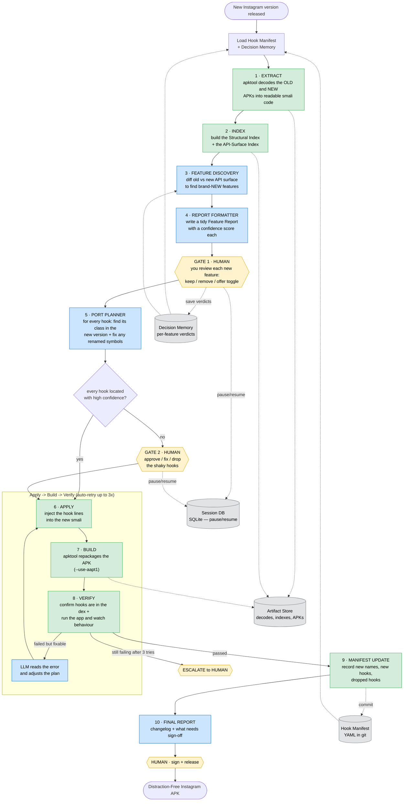

# dfinsta e2e flowchart

## Flowchart



**Legend:** 

🟩 green = deterministic script (no AI)

🟦 blue = LLM agent (reasoning)

🟨 yellow = human decision

⬜ grey = storage.

---

## What happens at each stage

**0 · Load** — Read the two long-term memories: the *Hook Manifest* (the recipe book of every
change we make) and the *Decision Memory* (past verdicts on features). This is how the system
remembers everything it learned in previous versions.

**1 · Extract** — `apktool` turns both the old and new Instagram APKs (which are just compiled
binaries) back into human/agent-readable `smali` code. We need the old one as a reference and the
new one as our target.

**2 · Index** — Reading 120,000 files for every question is far too slow. So we make two fast
lookup tables once: the *Structural Index* (every class and its shape) and the *API-Surface Index*
(the stable, unscrambled clues like URLs and feature names).

**3 · Feature Discovery** — Compare the new app's API surface to the old one. Anything new (a new
URL, a new feature flag) is a candidate new feature. The agent skips anything already in Decision
Memory, so you're only shown genuinely new things.

**4 · Report Formatter** — Turn those findings into a clean, structured *Feature Report*: what the
feature is, how it's delivered, whether it looks like a distraction, and a confidence score.

**GATE 1 (human)** — The pipeline pauses and sends you the report. You decide per feature: leave it
alone, block it outright, or add a user toggle in settings. Your answers are saved to Decision
Memory so you're never asked twice.

**5 · Port Planner** — For every hook in the manifest (the existing ones + any new ones you
approved), find the right class in the *new* Instagram version and translate any scrambled names
that changed. Each hook gets a confidence score.

**GATE 2 (human, only if needed)** — If any hook couldn't be located confidently, or a feature it
depends on disappeared, the pipeline pauses and asks you to approve, fix, or drop just those.

**6–8 · Apply → Build → Verify (loop)** — *Apply* injects the hook lines into the new smali.
*Build* repackages it into an APK. *Verify* checks the hooks actually made it in and runs the app to
confirm the behaviour. If the build or check fails in a fixable way, an LLM reads the error, adjusts,
and tries again (up to 3 times). If it still fails, it escalates to you.

**9 · Manifest Update** — Save what we learned this version back into the Hook Manifest: the new
class names, any hooks added, any hooks that had to be dropped. This is what makes next version
easier.

**10 · Final Report → Sign-off** — Produce a human-readable changelog and hand you an
unsigned-but-ready APK. *You* sign and distribute it — the robot never ships on its own.

---

## Key terms

- **Hook** — a few lines of code we splice into Instagram to change its behaviour (block a request,
  capture a value, hide a screen). Think of a small tap spliced into a pipe.
- **Hook Manifest** — the master recipe book listing every hook: what it does, how to find where it
  goes, and the code to inject. It is *version-independent intent* and the system's source of truth.
- **Structural Index** — a pre-built phone-book of every class in the decompiled app (its name,
  parent class, interfaces). Built once per version so the agent finds classes instantly instead of
  scanning 120k files each time.
- **API-Surface Index** — the list of things Instagram *can't* easily scramble: the URLs it calls,
  feature-flag names, text/resource names. These are stable clues used to spot new features.
- **Obfuscation** — Instagram renames its classes/fields to gibberish (`LX/1bI`) and changes the
  gibberish every release. This is the root reason the job is hard.
- **Delta** — the *actual* change a hook makes: just the handful of injected lines, not the whole
  class. Working with deltas (not whole-class copies) is what makes this tractable.
- **Fingerprint** — a recognizable signature for finding a renamed class, e.g. "the class that
  implements `TigonCallbacks`" or "references `FeedCacheCoordinator` AND calls `getRootActivity`".
- **Anchor** — the exact spot inside a method where a hook is inserted (e.g. "right after the call
  to `logQPL`").
- **Remap** — translating the scrambled names a hook depends on from old to new (e.g. field
  `A08` → `A09`).
- **Tier** — how robust a hook is: *robust* (URL block) · *fragile* (rewrite a response body) ·
  *ui* (hide an on-screen element). Fragile/ui hooks are the ones that need human review.
- **Delivery branch (A/B/C)** — how Instagram serves a feature: **A** = its own URL (easy to block),
  **B** = mixed into an existing response (medium), **C** = pure on-screen UI (hard).

---

## Data structures

| Structure | Format | Holds | Lifetime |
|---|---|---|---|
| **Hook Manifest** | YAML list of hook objects | id, intent, tier, strategy, host_fingerprint, anchor, payload_template, remap rules, semantic_deps, status | **permanent** (git) |
| **Decision Memory** | JSON/YAML map (or SQLite table) | feature_signature → {verdict, version_decided, pref_key} | **permanent** (git) |
| **Structural Index** | JSONL / dict | descriptor → {file, super, interfaces, methods} (~120k rows) | per-version cache |
| **API Surface** | JSON sets | {endpoints[], flags[], resources[], permissions[]} | per-version cache |
| **Feature Report** | Pydantic `list[FeatureAssessment]` | name, evidence, delivery_branch, category, engagement_signals, recommendation, confidence, rationale | one run |
| **Port Plan** | list of dicts | hook_id, host_file, anchor_line, payload, remap, confidence | one run |
| **Session State** | dict (ADK) | paths, features, decisions, port_plan, build_result | one run |

A **Hook Manifest entry** looks like:
```yaml
- id: block_feed_timeline
  intent: "block main feed when disable_feed is set"
  tier: robust            # robust | fragile | ui
  strategy: url_block      # url_block | response_rewrite | ui_suppress | lifecycle
  semantic_deps: ["/feed/timeline/"]          # stable strings that must still exist
  host_fingerprint: { kind: named, descriptor: "Lcom/instagram/api/tigon/TigonServiceLayer;" }
  anchor: { after: "->logQPL(", then_label: ":try_start_0" }
  payload_template: |
    iget-object v0, {req_reg}, {reqinfo_cls}->{uri_field}:Ljava/net/URI;
    invoke-static {v0}, Lcom/dfinstagram/hooks;->throwIfBlocked(Ljava/net/URI;)V
  remap: { reqinfo_cls: { by: field_type, type: "Ljava/net/URI;", role: request_info } }
  status: active           # active | dropped@1.4.1 | needs_review
```

---

## Long-term memory & storage plan

There are **four** stores, with very different jobs:

1. **Hook Manifest — the brain. (YAML, in the dfinsta git repo.)**
   The durable "what we do and why," independent of any Instagram version. Human-readable and
   diffable, so every change is reviewable in a pull request. Agents *read* it at Load (it's small,
   so it goes into session state) and the Manifest-Update stage *writes it back and git-commits* it.
   This is what lets version N+1 reuse everything learned in version N.

2. **Decision Memory — the preferences journal. (JSON/YAML, in git next to the manifest.)**
   Keyed by a *stable feature signature* (the endpoint path or flag name, which survives
   obfuscation). Stores your verdict (block / toggle / ignore), the version you decided it in, and
   any settings key created. Feature Discovery consults it to *auto-skip features you've already
   ruled on*, so Gate 1 only ever asks about genuinely new things. Gate 1 appends to it.

3. **Artifact Store — the scratch warehouse. (Filesystem / object storage, NOT git, NOT in prompts.)**
   The big derived files: decoded smali trees (GBs), the structural/API indexes (tens of MB), built
   APKs. Keyed by APK version + content hash. Managed via ADK's `ArtifactService`. Because these are
   huge, **agents only ever pass file PATHS and small excerpts** — raw contents never enter an LLM
   prompt or session state. It's a regenerable cache, not a source of truth.

4. **Session DB — the save-game. (ADK `DatabaseSessionService`: SQLite locally, Postgres in prod.)**
   Holds the live run's session state and, crucially, the *suspended state of a human gate*. Because
   a gate can stay paused for days, this must be on disk — so a restart doesn't lose the run, and you
   can resume exactly where it stopped when your decision arrives.

**How the agents touch storage, in one sentence each:**
- Deterministic tools read/write the Artifact Store and indexes directly on disk.
- LLM agents see only paths + summaries from session state — never the raw decodes or index.
- Manifest + Decision Memory load into state at the start and are committed back at the end, so the
  system *learns across versions* instead of starting fresh each time.
- The Session DB is handled automatically by the ADK Runner; the human-gate tools serialize their
  "pending" state there so the pause survives restarts.
